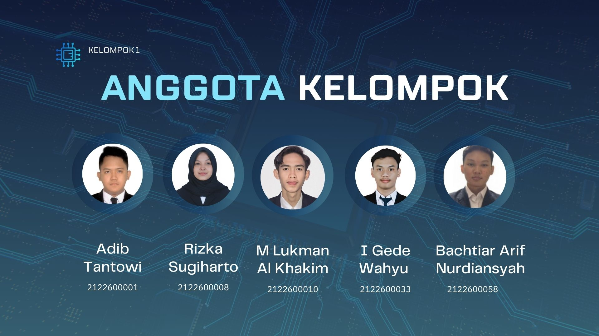

  

# Smart Work Monitoring System with Drowsiness Detection

Program Smart Work Monitoring System with Drowsiness Detection merupakan sistem berbasis Python yang mengintegrasikan OpenCV, MediaPipe, dan Tkinter GUI untuk memantau kondisi pengguna selama bekerja. Sistem ini mampu mendeteksi wajah, memantau tingkat kantuk, dan mengatur waktu kerja–istirahat otomatis. Fitur popup subprocess digunakan agar peringatan atau notifikasi muncul di jendela terpisah tanpa mengganggu tampilan utama. Seluruh proses berjalan real-time dan terintegrasi dengan GUI interaktif yang menampilkan status, timer, serta deteksi kamera secara langsung. [Slide Presentasi ](https://www.canva.com/design/DAG3yUKhn_I/yiX45X-ePNh0IJsWycyO4A/edit)

`PENGOLAHAN CITRA - PROGRAM STUDI TEKNIK ELEKTRONIKA - POLITEKNIK ELEKTRONIKA NEGERI SURABAYA`

`DOSEN PENGAMPU : Akhmad Hendriawan ST, MT`
`NIP. 197501272002121003`

# Tujuan
1. Mendeteksi wajah dan tanda-tanda kantuk pengguna (mata tertutup, menguap, kepala miring) secara real-time melalui kamera.
2. Mengatur siklus kerja → istirahat → persiapan → kerja secara otomatis.
3. Memberikan peringatan visual (popup) dan audio (alarm) bila pengguna mengantuk atau perlu istirahat.
4. Menggunakan GUI berbasis Tkinter untuk menampilkan status, waktu, dan hasil deteksi secara interaktif.

# Fitur Utama

| Fitur | Deskripsi Singkat      |
| :--:| :------------------:| 
| 🧍‍♂️ Deteksi Wajah Real-Time  | Sistem menggunakan Haar Cascade dan MediaPipe FaceMesh untuk mendeteksi posisi wajah pengguna secara langsung dari webcam.   | 
| 😴 Deteksi Kantuk Otomatis (Drowsiness Detection)   | Berdasarkan Eye Aspect Ratio (EAR) dan Mouth Aspect Ratio (MAR), sistem mendeteksi apakah pengguna mengantuk, menguap, atau kehilangan fokus. |
|  🔊 Peringatan Kantuk (Drowsy Alert)  | Menampilkan popup merah dan memutar suara alarm ketika kondisi kantuk terdeteksi.       | 
| 🕒 Manajemen Waktu Kerja–Istirahat Otomatis   | Sistem otomatis beralih antar mode: WORK → BREAK → PREPARE → WORK sesuai durasi yang diatur pengguna.  |
| 💬 Notifikasi Visual Real-Time   | Tampilan GUI berubah warna dan teks untuk menunjukkan status terkini pengguna (kerja, istirahat, persiapan, atau kantuk).     | 
| 💻 Tampilan GUI Monitoring   | Menampilkan live feed kamera, timer, status mode, dan indikator deteksi wajah secara real-time.    | 
| 🎨 Integrasi PaintApp GUI (opsional) | Pengguna dapat menggambar, mencatat, atau menulis selama sesi kerja berlangsung.     | 
| 🪟 Popup Subprocess Terpisah  |Peringatan muncul di jendela terpisah (bukan di GUI utama) agar tidak menumpuk dan lebih stabil di threading.  | 
| 🧩 Konfigurasi Awal via GUI Setup   | Pengguna dapat menentukan durasi kerja, istirahat, dan waktu persiapan sebelum sistem mulai berjalan.    | 

# Teammates

  

<table align="center">
  <thead>
    <tr>
      <th width="40px">No.</th>
      <th width="250px">Nama</th>
      <th width="120px">NRP</th>
      <th width="100px">GitHub</th>
    </tr>
  </thead>
  <tbody align="center">
    <tr>
      <td>1</td>
      <td>M. Adib Tantowi Jauhari</td>
      <td>2122600001</td>
      <td>
        
      </td>
    </tr>
    <tr>
      <td>2</td>
      <td>Rizka Sugiharto</td>
      <td>2122600008</td>
      <td>
        
      </td>
    </tr>
    <tr>
      <td>3</td>
      <td>Muhammad Lukman Al Khakim</td>
      <td>2122600010</td>
      <td>
        
      </td>
    </tr>
    <tr>
      <td>4</td>
      <td>I Gede Wahyu Satria Nugraha</td>
      <td>2122600033</td>
      <td>
        
      </td>
    </tr>
    <tr>
      <td>5</td>
      <td>Bachtiar Arif Nurdiansyah</td>
      <td>2122600058</td>
      <td>
        
      </td>
    </tr>
  </tbody>
</table>

# Technologies Used
🐍 Python 3.9+

🎥 OpenCV – kamera & deteksi wajah

🧠 MediaPipe FaceMesh – landmark wajah & perhitungan EAR/MAR

🪟 Tkinter – GUI utama (kanvas menggambar, tombol, status)

🎵 Pygame – sistem audio alarm

🧪 Numpy - perhitungan koordinat wajah dan rasio mata/mulut secara numerik.

🗂️ OS & Sys Module - mengatur direktori kerja, menangani argumen CLI, dan memastikan path file GUI popup berjalan benar.

🔄 Subprocess (Popup Window) - popup peringatan kantuk / notifikasi di jendela terpisah tanpa mengganggu GUI utama.

# Daftar Isi
- [Diagram Alur](#Diagram-Alur)
- [Output](HASIL%20TES.md)
- [Program](PROGRAM/)
- [Saran](SARAN.md)

# Diagram Alur

  

